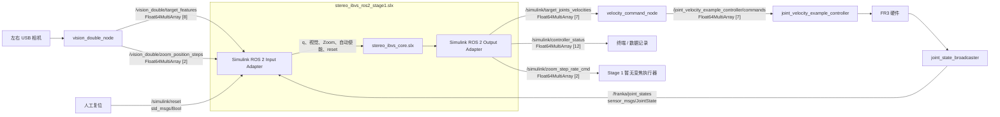

# visual_servo_tag

## 1. 概述

`visual_servo_tag` 是面向 Franka Research 3（FR3）的双目视觉伺服项目。双 USB 相机负责 AprilTag 检测，Simulink 负责视觉控制、FR3 运动学和算法层安全，Python ROS 2 节点负责最终限速、平滑减速和底层速度转发。

当前已完成 Stage 1 的初步搭建：使用固定相机内参和固定深度执行左相机中心 IBVS。下一步是双相机、ROS 2、标定和 FR3 低速实验验证。

## 2. 项目框架

```text
visual_servo_tag/
├── config/
│   ├── controllers.yaml
│   ├── velocity_servo_tag.yaml
│   └── urdf/fr3.urdf
├── launch/
│   ├── vision_double.launch.py
│   ├── velocity_servo_tag.launch.py
│   ├── fr3_hardware.launch.py
│   └── full_system.launch.py
├── simulink/
│   ├── build/sim/build_stereo_ibvs_sim_stage1.m
│   ├── config/stereo_ibvs_config.m
│   ├── core/stereo_ibvs_core.slx
│   ├── ros2/stereo_ibvs_ros2_stage1.slx
│   └── sim/stereo_ibvs_sim_stage1.slx
├── velocity_servo_tag/
│   ├── velocity_command_node.py
│   └── vision/
│       ├── apriltag_detector.py
│       ├── camera.py
│       ├── stereo_features.py
│       └── vision_double_node.py
├── test/
├── package.xml
└── setup.py
```

- `vision_double_node`：读取左右相机并发布双目 AprilTag 特征；
- `stereo_ibvs_ros2_stage1.slx`：完成 ROS 2 消息适配、输入新鲜度和自动使能；
- `stereo_ibvs_core.slx`：完成 Stage 1 IBVS、FR3 运动学、限速和诊断；
- `velocity_command_node`：向 FR3 控制器发送最终七维速度，并负责加速度限制和平滑停车。

## 3. 如何部署

目标环境：Ubuntu 24.04、ROS 2 Jazzy、Python 3.12、MATLAB R2025b。

### 3.1 下载项目

```bash
mkdir -p ~/franka_ros2_ws/src
cd ~/franka_ros2_ws/src
git clone https://github.com/charliehu329/visual_servo_tag.git
```

### 3.2 安装依赖

本项目依赖 [sunflower050105/franka_ros2](https://github.com/sunflower050105/franka_ros2) 的 `jazzy` 分支，而不是官方仓库的同名示例控制器。该分支保留了自定义 `JointVelocityExampleController`，会订阅七维速度命令并进行底层滤波。

```bash
cd ~/franka_ros2_ws/src
git clone -b jazzy https://github.com/sunflower050105/franka_ros2.git franka_ros2
```

```bash
cd ~/franka_ros2_ws
source /opt/ros/jazzy/setup.bash
rosdep install --from-paths src --ignore-src -r -y
```

AprilTag 检测器建议安装在能够读取系统 ROS 2 包的虚拟环境中：

```bash
cd ~/franka_ros2_ws
python3 -m venv --system-site-packages .venv
source .venv/bin/activate
python3 -m pip install --upgrade pip
python3 -m pip install pupil-apriltags
```

### 3.3 编译

进入工作区：

```bash
cd ~/franka_ros2_ws
```

加载 ROS 2 和 Python 环境：

```bash
source /opt/ros/jazzy/setup.bash
source .venv/bin/activate
```

编译：

```bash
colcon build --symlink-install --packages-select velocity_servo_tag
```

加载编译结果：

```bash
source install/setup.bash
```

启动 FR3 控制器后，检查实际加载的是上述自定义控制器：

```bash
ros2 pkg prefix franka_example_controllers
ros2 topic info -v /joint_velocity_example_controller/commands
ros2 param get /joint_velocity_example_controller filter_coefficient
```

命令 Topic 应显示一个控制器订阅者，`filter_coefficient` 应为 `0.01`。

## 4. 如何运行

### 4.1 每个新终端的准备

进入工作区：

```bash
cd ~/franka_ros2_ws
```

加载 ROS 2 环境：

```bash
source /opt/ros/jazzy/setup.bash
```

加载 Python 虚拟环境（如有）：
```bash
source .venv/bin/activate
```

代码修改后重新编译：

```bash
colcon build --symlink-install --packages-select velocity_servo_tag
```

加载当前工作区：

```bash
source install/setup.bash
```

### 4.2 Launch 启动命令

以下命令按需要选择，不需要全部同时运行。

只启动双目视觉：

```bash
ros2 launch velocity_servo_tag vision_double.launch.py
```

通过上层视觉入口启动：

```bash
ros2 launch velocity_servo_tag velocity_servo_tag.launch.py
```

启动 FR3 硬件并保持零速度模式：

```bash
ros2 launch velocity_servo_tag fr3_hardware.launch.py \
  robot_ip:=172.16.0.2 \
  command_mode:=zero
```

启动统一入口，默认只启动双目视觉、不连接 FR3：

```bash
ros2 launch velocity_servo_tag full_system.launch.py \
  start_vision:=true \
  start_hardware:=false \
  command_mode:=zero
```

### 4.3 Launch 说明和参数

#### `vision_double.launch.py`

只启动一个节点：

```text
vision_double_node
```

| 参数 | 默认值 | 作用 |
|---|---|---|
| `params_file` | 包内 `config/velocity_servo_tag.yaml` | ROS 2 参数文件 |

#### `velocity_servo_tag.launch.py`

只启动一个节点：

```text
vision_double_node
```

`start_vision=false` 时不启动任何节点。

| 参数 | 默认值 | 作用 |
|---|---|---|
| `params_file` | 包内 `config/velocity_servo_tag.yaml` | ROS 2 参数文件 |
| `start_vision` | `true` | 是否启动 `vision_double_node` |

#### `fr3_hardware.launch.py`

启动以下组件：

```text
Franka硬件驱动
joint_state_broadcaster
franka_robot_state_broadcaster
joint_velocity_example_controller
velocity_command_node
```

不启动双目视觉或 MATLAB/Simulink。默认 `command_mode=zero`。

| 参数 | 默认值 | 作用 |
|---|---|---|
| `robot_ip` | `172.16.0.2` | FR3 IP 地址 |
| `load_gripper` | `false` | 是否加载 Franka Hand |
| `use_rviz` | `false` | 是否启动 RViz2 |
| `command_mode` | `zero` | `zero` 持续发送零速度；`topic` 接收 Simulink 速度 |
| `max_velocity_scale` | `0.10` | 相对 FR3 官方速度上限的最终比例 |
| `params_file` | 包内 `config/velocity_servo_tag.yaml` | ROS 2 参数文件 |

#### `full_system.launch.py`

统一组合以下两部分：

```text
vision_double_node
可选的FR3硬件链路
```

默认只启动 `vision_double_node`，不连接真实硬件，也不启动 MATLAB/Simulink。

| 参数 | 默认值 | 作用 |
|---|---|---|
| `start_vision` | `true` | 是否启动双目视觉 |
| `start_hardware` | `false` | 是否启动真实 FR3 硬件链路 |
| `robot_ip` | `172.16.0.2` | FR3 IP 地址 |
| `load_gripper` | `false` | 是否加载 Franka Hand |
| `use_rviz` | `false` | 是否启动 RViz2 |
| `command_mode` | `zero` | 底层使用 `zero` 或 `topic` 模式 |
| `max_velocity_scale` | `0.10` | 最终速度限制比例 |
| `params_file` | 包内 `config/velocity_servo_tag.yaml` | ROS 2 参数文件 |

### 4.4 启动 MATLAB/Simulink

MATLAB/Simulink 不会被任何 Launch 自动启动。建议从已经加载 ROS 2 环境的终端启动 MATLAB：

在终端执行：

```bash
cd ~/franka_ros2_ws
source /opt/ros/jazzy/setup.bash
source install/setup.bash
matlab
```

在 MATLAB 命令窗口执行：

```matlab
repoDir = fullfile(getenv('HOME'), ...
    'franka_ros2_ws', 'src', 'visual_servo_tag');

addpath(fullfile(repoDir, 'simulink', 'core'));
addpath(fullfile(repoDir, 'simulink', 'config'));

run(fullfile(repoDir, 'simulink', 'config', ...
    'stereo_ibvs_config.m'));

open_system(fullfile(repoDir, 'simulink', 'ros2', ...
    'stereo_ibvs_ros2_stage1.slx'));
```

打开模型后执行 Update Diagram，再运行模型。当前标定许可默认为 `false`，因此关节速度保持为零属于正常安全行为。

#### 每次启动

每个新的 MATLAB 会话都先执行上面的终端命令，再执行 MATLAB 命令窗口中的初始化命令。不需要每次都运行 `colcon build`。

#### 修改文件后

- 修改 `.m` 配置：重新运行 `stereo_ibvs_config.m`，然后执行 Update Diagram；
- 修改 `.slx`：保存模型，然后执行 Update Diagram；
- 修改 Python、Launch 或 YAML：重新运行 `colcon build`，再执行 `source install/setup.bash`；
- 只修改 MATLAB/Simulink 文件：不需要运行 colcon 编译。

## 5. 数据流向



## 6. ROS 2 节点与 Topic

### 6.1 主要节点

| 节点或组件 | 作用 |
|---|---|
| `vision_double_node` | 采集左右相机、检测 AprilTag、发布 8 维视觉特征和 Zoom 零占位 |
| `stereo_ibvs_ros2_stage1.slx` | 订阅 ROS 输入、执行自动安全使能、调用 Core 并发布控制结果 |
| `velocity_command_node` | 检查七维速度、最终限速、限制加速度、超时和退出时平滑停车 |
| `joint_state_broadcaster` | 发布 FR3 关节状态 |
| `joint_velocity_example_controller` | 以 1 kHz 向 FR3 硬件执行关节速度命令 |
| `apriltag_detector` | 可选的单相机测试节点，不在当前 Stage 1 主链路中 |

### 6.2 Topic 接口

| Topic | 发布者 | 订阅者 | 消息类型 | 数据内容 |
|---|---|---|---|---|
| `/vision_double/target_features` | `vision_double_node` | Simulink | `Float64MultiArray` | 8 维双目特征 |
| `/vision_double/zoom_position_steps` | `vision_double_node` | Simulink | `Float64MultiArray` | Stage 1 固定 `[0,0]` |
| `/franka/joint_states` | `joint_state_broadcaster` | Simulink | `sensor_msgs/JointState` | 关节名称、位置和速度等状态 |
| `/simulink/reset` | 操作者 | Simulink | `std_msgs/Bool` | 单次 `true` 复位请求 |
| `/simulink/target_joints_velocities` | Simulink | `velocity_command_node` | `Float64MultiArray` | 7 维目标关节速度，`rad/s` |
| `/simulink/zoom_step_rate_cmd` | Simulink | Stage 1 无订阅者 | `Float64MultiArray` | 2 维变焦步速，Stage 1 为零 |
| `/simulink/controller_status` | Simulink | 终端或记录工具 | `Float64MultiArray` | 12 维控制诊断状态 |
| `/joint_velocity_example_controller/commands` | `velocity_command_node` | FR3 速度控制器 | `Float64MultiArray` | 最终 7 维关节速度命令 |

视觉特征顺序：

```text
[validL, validR, uL, vL, uR, vR, scaleL, scaleR]
```

- `validL/validR`：左右检测是否有效；
- `u/v`：AprilTag 中心像素坐标；
- `scale`：AprilTag 四角像素面积的平方根。

`controller_status` 顺序：

```text
[inputDataValid, cameraModelValid, kinematicsValid,
 validLeft, validRight, depthMeasurementValid,
 centerTaskValid, safetyValid, ekfValid,
 zoomControllerValid, controllerEnable, jConditionMetric]
```

当前 Simulink 直接读取 `JointState.position` 前 7 项，尚未按照 `JointState.name` 重排。非零真机实验前必须确认前七项对应 `fr3_joint1` 到 `fr3_joint7`。

## 7. 配置文件

| 配置文件 | 谁读取 | 控制哪些文件/节点 |
|---|---|---|
| `config/velocity_servo_tag.yaml` | Launch 将参数传给 ROS 2 节点 | `vision_double_node`、`velocity_command_node` |
| `config/controllers.yaml` | `fr3_hardware.launch.py` 传给 `controller_manager` | 状态广播器、`joint_velocity_example_controller` 及其底层滤波 |
| `simulink/config/stereo_ibvs_config.m` | 三个 Simulink 模型的初始化回调 | `stereo_ibvs_core.slx`、`stereo_ibvs_ros2_stage1.slx`、`stereo_ibvs_sim_stage1.slx` |
| `config/urdf/fr3.urdf` | `stereo_ibvs_config.m` | 三个 Simulink 模型使用的 FR3 运动学模型 |

Python 节点读取 YAML；Simulink `.slx` 不读取 YAML。`simulink_ros2` YAML 段只记录接口，Simulink 的实际 Topic 位于 ROS 2 Block 中，实际安全参数由 `stereo_ibvs_config.m` 加载。

常用参数：

```text
相机：640×480，目标 60 Hz
Simulink：120 Hz
Joint/Vision freshness：0.10 s
左目标丢失/恢复：3 帧
Simulink最大关节速度：0.03 rad/s
Python关节加速度限制：0.20 rad/s²
Python命令超时：0.15 s
```

## 8. 安全机制

- `velocity_command_node` 默认使用 `zero`，只有明确设置 `topic` 才转发 Simulink 速度；
- Stage 1 只以左相机 `validL` 判断目标状态，连续第 3 帧丢失时关闭内部使能；
- JointState 或 Vision 超过 `0.10 s` 没有新消息时，Simulink 自动输出零目标；
- 数据恢复后需要连续 3 帧左目标有效才重新使能；
- Python 节点对实际发送速度实施最终限速和 `0.20 rad/s²` 加速度限制，实现平滑停车；
- 手眼标定和左相机内参标定完成前，`stage1CalibrationReady=false`，Core 锁定零速度；
- 软件保护不能替代 FR3 实体急停。

## 9. 分阶段目标

- Stage 1：完成固定内参、固定深度的左相机中心 IBVS，并完成双相机、ROS 2 和 FR3 低速实验验证；
- Stage 2～3：加入双目深度/逆深度闭环，以及关节限位零空间任务；
- Stage 4～5：加入目标 EKF、速度前馈和真实主动变焦；
- Stage 6：完成预测、时延补偿、故障恢复和完整真机验证。

## 10. License

本项目使用 Apache-2.0 License。

## 11. 测试

目前 Stage 1 的代码和安全结构已经初步完成，接下来按顺序进行以下测试。

### 1. 双相机实机测试

- 在 Ubuntu 24.04 / ROS 2 Jazzy 编译项目；
- 设置左右 USB 相机 ID；
- 验证 AprilTag 检测和实际发布频率；
- 检查 `/vision_double/target_features` 是否稳定接近 60 Hz。

### 2. 零速度全链路联调

```text
双相机 → vision_double_node → Simulink → velocity_command_node
```

- 保持 `command_mode=zero`；
- 验证自动使能、左目标连续丢失 3 帧、Vision/Joint 超时和恢复；
- 检查 `/simulink/controller_status` 和七维速度格式。

### 3. 核对 JointState 顺序

- 确认 `/franka/joint_states` 前七项对应 `fr3_joint1～fr3_joint7`；
- 如果顺序不固定，再在 Simulink 包装层加入按照 `JointState.name` 重排。

### 4. 完成真实标定

- 标定左相机内参和左相机相对 FR3 末端的安装关系；
- 将结果写入 `stereo_ibvs_config.m`；
- 验证坐标方向、单位和图像误差方向后，再开放标定许可。

### 5. FR3 低速实验

- 先测试底层 `zero` 模式并准备实体急停；
- 当前 C++ 控制器没有命令 freshness watchdog，不能用关闭终端代替实体急停；
- 再切换到 `topic`，从很小的图像偏差开始；
- 保持 `0.03 rad/s` Simulink 限速和 `0.20 rad/s²` Python 加速度限制；
- 验证运动方向以及目标丢失后的平滑停车。

完成以上测试后，Stage 1 才算完成真实实验验证。
