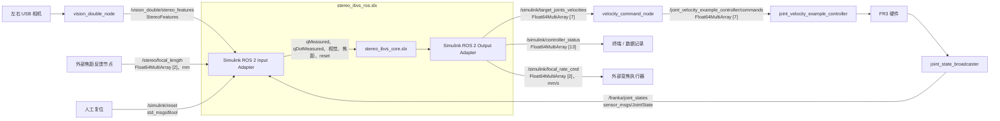
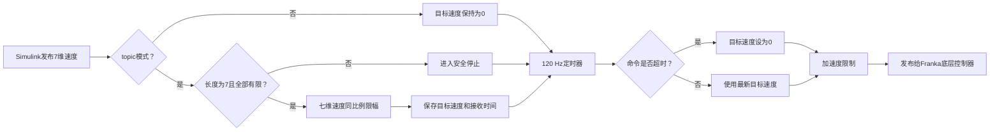

# visual_servo_tag

## 1. 概述

`visual_servo_tag` 是面向 Franka Research 3（FR3）的双目视觉伺服项目。双 USB 相机负责 AprilTag 检测，Simulink 负责双目估计、视觉控制、FR3 运动学和算法层安全，Python ROS 2 节点负责真实新帧发布、最终限速、平滑减速和底层速度转发。

当前已经将仿真验证过的 V2 控制逻辑重构为 Core、ROS 2 包装层和 Python 安全层：支持带序号与采集时间的双目特征、JointState 实际位置/速度反馈、目标 EKF、逆深度动态、中心/深度任务、主动变焦接口，以及七维同比例速度和加速度限制。当前标定许可仍保持关闭，下一步是接入外部焦距反馈、完成真实标定，并从零速度开始进行 ROS 2 和 FR3 低速实验验证。

## 2. 项目框架

```text
visual_servo_tag_project/
├── velocity_servo_tag/
│   ├── config/
│   │   ├── controllers.yaml
│   │   ├── velocity_servo_tag.yaml
│   │   └── urdf/fr3.urdf
│   ├── launch/
│   │   ├── vision_double.launch.py
│   │   ├── velocity_servo_tag.launch.py
│   │   ├── fr3_hardware.launch.py
│   │   └── full_system.launch.py
│   ├── velocity_servo_tag/
│   │   ├── velocity_command_node.py
│   │   └── vision/
│   │       ├── apriltag_detector.py
│   │       ├── camera.py
│   │       ├── stereo_features.py
│   │       └── vision_double_node.py
│   ├── test/
│   ├── package.xml
│   └── setup.py
├── velocity_servo_tag_interfaces/
│   ├── msg/StereoFeatures.msg
│   ├── CMakeLists.txt
│   └── package.xml
├── simulink/
│   ├── build/core/build_stereo_ibvs_core.m
│   ├── build/ros/build_stereo_ibvs_ros.m
│   ├── build/sim/build_stereo_ibvs_sim_stage1.m
│   ├── config/stereo_ibvs_config.m
│   ├── core/stereo_ibvs_core.slx
│   ├── ros2/stereo_ibvs_ros.slx
│   └── sim/stereo_ibvs_sim_stage1.slx
├── README.md
└── memory.md
```

- `vision_double_node`：读取左右相机，只在真实新帧到达时发布 `StereoFeatures`；
- `velocity_servo_tag_interfaces`：生成 Python、ROS 2 和 Simulink 共用的自定义消息；
- `stereo_ibvs_ros.slx`：完成 ROS 2 消息适配、新帧/新配对判断、JointState 重排和自动使能；
- `stereo_ibvs_core.slx`：完成 V2 双目估计、任务控制、FR3 运动学、安全限制和诊断；
- `velocity_command_node`：向 FR3 控制器发送最终七维速度，并负责加速度限制和平滑停车。

## 3. 如何部署

目标环境：Ubuntu 24.04、ROS 2 Jazzy、Python 3.12、MATLAB R2025b。

### 3.1 下载项目

```bash
mkdir -p ~/franka_ros2_ws/src
cd ~/franka_ros2_ws/src
git clone https://github.com/charliehu329/visual_servo_tag.git \
  visual_servo_tag_project
```

### 3.2 安装依赖

本项目依赖 [sunflower050105/franka_ros2](https://github.com/sunflower050105/franka_ros2) 的 `jazzy` 分支，而不是官方仓库的同名示例控制器。该分支保留了自定义 `JointVelocityExampleController`，会订阅七维速度命令并进行底层滤波。

```bash
cd ~/franka_ros2_ws/src
git clone -b jazzy https://github.com/sunflower050105/franka_ros2.git franka_ros2
```

```bash
cd ~/franka_ros2_ws
source /opt/ros/jazzy/setup.bash
rosdep install --from-paths src --ignore-src -r -y
```

AprilTag 检测器建议安装在能够读取系统 ROS 2 包的虚拟环境中：

```bash
cd ~/franka_ros2_ws
python3 -m venv --system-site-packages .venv
source .venv/bin/activate
python3 -m pip install --upgrade pip
python3 -m pip install pupil-apriltags
```

### 3.3 编译

进入工作区：

```bash
cd ~/franka_ros2_ws
```

加载 ROS 2 和 Python 环境：

```bash
source /opt/ros/jazzy/setup.bash
source .venv/bin/activate
```

编译：

```bash
colcon build --symlink-install --packages-up-to velocity_servo_tag
```

加载编译结果：

```bash
source install/setup.bash
```

检查两个包和自定义消息是否可见：

```bash
ros2 pkg prefix velocity_servo_tag
ros2 pkg prefix velocity_servo_tag_interfaces
ros2 interface show \
  velocity_servo_tag_interfaces/msg/StereoFeatures
```

启动 FR3 控制器后，检查实际加载的是上述自定义控制器：

```bash
ros2 pkg prefix franka_example_controllers
ros2 topic info -v /joint_velocity_example_controller/commands
ros2 param get /joint_velocity_example_controller filter_coefficient
```

命令 Topic 应显示一个控制器订阅者，`filter_coefficient` 应为 `0.01`。

### 3.4 配置 MATLAB ROS Toolbox

`stereo_ibvs_ros.slx` 使用自定义 `StereoFeatures`，第一次构建前需要在 MATLAB 中为 ROS Toolbox 配置 Python：

1. 打开 `Home → Preferences → ROS Toolbox`；
2. 点击 `Open ROS Toolbox Preferences`；
3. Python Executable 选择 Ubuntu 上的 `/usr/bin/python3`；
4. 点击 `Recreate Python Environment`。

ROS Build 第一次运行时会调用 `ros2genmsg(projectRoot)`，并将生成结果保存到仓库根目录下的 `matlab_msg_gen/`。该目录是平台相关的自动生成文件，不纳入 Git。

## 4. 如何运行

### 4.1 每个新终端的准备

进入工作区：

```bash
cd ~/franka_ros2_ws
```

加载 ROS 2 环境：

```bash
source /opt/ros/jazzy/setup.bash
```

加载 Python 虚拟环境（如有）：
```bash
source .venv/bin/activate
```

代码修改后重新编译：

```bash
colcon build --symlink-install --packages-up-to velocity_servo_tag
```

加载当前工作区：

```bash
source install/setup.bash
```

### 4.2 Launch 启动命令

以下命令按需要选择，不需要全部同时运行。

只启动双目视觉：

```bash
ros2 launch velocity_servo_tag vision_double.launch.py
```

通过上层视觉入口启动：

```bash
ros2 launch velocity_servo_tag velocity_servo_tag.launch.py
```

启动 FR3 硬件并保持零速度模式：

```bash
ros2 launch velocity_servo_tag fr3_hardware.launch.py \
  robot_ip:=172.16.0.2 \
  command_mode:=zero
```

启动统一入口，默认只启动双目视觉、不连接 FR3：

```bash
ros2 launch velocity_servo_tag full_system.launch.py \
  start_vision:=true \
  start_hardware:=false \
  command_mode:=zero
```

### 4.3 Launch 说明和参数

#### `vision_double.launch.py`

只启动一个节点：

```text
vision_double_node
```

| 参数 | 默认值 | 作用 |
|---|---|---|
| `params_file` | 包内 `config/velocity_servo_tag.yaml` | ROS 2 参数文件 |

#### `velocity_servo_tag.launch.py`

只启动一个节点：

```text
vision_double_node
```

`start_vision=false` 时不启动任何节点。

| 参数 | 默认值 | 作用 |
|---|---|---|
| `params_file` | 包内 `config/velocity_servo_tag.yaml` | ROS 2 参数文件 |
| `start_vision` | `true` | 是否启动 `vision_double_node` |

#### `fr3_hardware.launch.py`

启动以下组件：

```text
Franka硬件驱动
joint_state_broadcaster
franka_robot_state_broadcaster
joint_velocity_example_controller
velocity_command_node
```

不启动双目视觉或 MATLAB/Simulink。默认 `command_mode=zero`。

| 参数 | 默认值 | 作用 |
|---|---|---|
| `robot_ip` | `172.16.0.2` | FR3 IP 地址 |
| `load_gripper` | `false` | 是否加载 Franka Hand |
| `use_rviz` | `false` | 是否启动 RViz2 |
| `command_mode` | `zero` | `zero` 持续发送零速度；`topic` 接收 Simulink 速度 |
| `max_velocity_scale` | `0.50` | 相对 FR3 官方速度上限的最终安全比例 |
| `params_file` | 包内 `config/velocity_servo_tag.yaml` | ROS 2 参数文件 |

#### `full_system.launch.py`

统一组合以下两部分：

```text
vision_double_node
可选的FR3硬件链路
```

默认只启动 `vision_double_node`，不连接真实硬件，也不启动 MATLAB/Simulink。

| 参数 | 默认值 | 作用 |
|---|---|---|
| `start_vision` | `true` | 是否启动双目视觉 |
| `start_hardware` | `false` | 是否启动真实 FR3 硬件链路 |
| `robot_ip` | `172.16.0.2` | FR3 IP 地址 |
| `load_gripper` | `false` | 是否加载 Franka Hand |
| `use_rviz` | `false` | 是否启动 RViz2 |
| `command_mode` | `zero` | 底层使用 `zero` 或 `topic` 模式 |
| `max_velocity_scale` | `0.50` | 最终安全速度限制比例 |
| `params_file` | 包内 `config/velocity_servo_tag.yaml` | ROS 2 参数文件 |

### 4.4 启动 MATLAB/Simulink

MATLAB/Simulink 不会被任何 Launch 自动启动。建议从已经加载 ROS 2 环境的终端启动 MATLAB：

在终端执行：

```bash
cd ~/franka_ros2_ws
source /opt/ros/jazzy/setup.bash
source install/setup.bash
matlab
```

在 MATLAB 命令窗口执行 ROS 包装层构建脚本：

```matlab
projectRoot = fullfile(getenv('HOME'), ...
    'franka_ros2_ws', 'src', 'visual_servo_tag_project');
run(fullfile(projectRoot, 'simulink', 'build', 'ros', ...
    'build_stereo_ibvs_ros.m'));
```

脚本会加载配置和 Core、检查或生成自定义消息支持，并重建 `stereo_ibvs_ros.slx`。构建完成后执行 Update Diagram，再运行模型。当前标定许可默认为 `false`，因此关节速度保持为零属于正常安全行为。

#### 每次启动

模型已经构建后，每个新的 MATLAB 会话只需加载 ROS 2 环境并打开模型：

```matlab
projectRoot = fullfile(getenv('HOME'), ...
    'franka_ros2_ws', 'src', 'visual_servo_tag_project');
open_system(fullfile(projectRoot, 'simulink', 'ros2', ...
    'stereo_ibvs_ros.slx'));
```

不需要每次都运行 `colcon build` 或重新生成自定义消息。

#### 修改文件后

- 修改 Core 或 ROS Build：重新运行 `build_stereo_ibvs_ros.m`；
- 只修改 `stereo_ibvs_config.m`：重新打开模型或重新运行配置，然后执行 Update Diagram；
- 修改 Python、Launch、YAML 或接口包：重新运行 `colcon build --symlink-install --packages-up-to velocity_servo_tag`，再执行 `source install/setup.bash`；
- 修改 `StereoFeatures.msg`：除 colcon 编译外，还需重新运行 ROS Build 生成 MATLAB 消息支持；
- 只修改 MATLAB/Simulink 文件：不需要运行 colcon 编译。

## 5. 数据流向

全流程数据流



velocity_command_node数据流



## 6. ROS 2 节点与 Topic

### 6.1 主要节点

| 节点或组件 | 作用 |
|---|---|
| `vision_double_node` | 采集左右相机、检测 AprilTag，并按真实新帧发布 `StereoFeatures` |
| `stereo_ibvs_ros.slx` | 适配 ROS 输入、重排 JointState、判断视觉新帧/新配对、调用 Core 并发布结果 |
| `velocity_command_node` | 检查七维速度、同比例最终限速、同比例加速度限制、超时和退出时平滑停车 |
| `joint_state_broadcaster` | 发布 FR3 关节状态 |
| `joint_velocity_example_controller` | 以 1 kHz 向 FR3 硬件执行关节速度命令 |
| `apriltag_detector` | 可选的单相机测试节点，不在当前双目主链路中 |

### 6.2 Topic 接口

| Topic | 发布者 | 订阅者 | 消息类型 | 数据内容 |
|---|---|---|---|---|
| `/vision_double/stereo_features` | `vision_double_node` | Simulink | `velocity_servo_tag_interfaces/StereoFeatures` | 左右序号、采集时间、有效性、中心和尺度 |
| `/franka/joint_states` | `joint_state_broadcaster` | Simulink | `sensor_msgs/JointState` | 关节名称、位置和速度等状态 |
| `/stereo/focal_length` | 外部焦距反馈节点 | Simulink | `Float64MultiArray` | 左右焦距，单位 `mm` |
| `/simulink/reset` | 操作者 | Simulink | `std_msgs/Bool` | 单次 `true` 复位请求 |
| `/simulink/target_joints_velocities` | Simulink | `velocity_command_node` | `Float64MultiArray` | 7 维目标关节速度，`rad/s` |
| `/simulink/focal_rate_cmd` | Simulink | 外部变焦执行器 | `Float64MultiArray` | 左右焦距变化率，单位 `mm/s` |
| `/simulink/controller_status` | Simulink | 终端或记录工具 | `Float64MultiArray` | 13 维控制诊断状态 |
| `/joint_velocity_example_controller/commands` | `velocity_command_node` | FR3 速度控制器 | `Float64MultiArray` | 最终 7 维关节速度命令 |

`StereoFeatures.msg` 包含：

```text
left_sequence、right_sequence
left_capture_stamp、right_capture_stamp
valid_left、valid_right
u_left、v_left、scale_left
u_right、v_right、scale_right
```

- 每成功读取一张真实相机帧，对应 `sequence` 才增加；
- 新帧未检测到 Tag 时仍发布一次，并设置对应 `valid=false`；
- 相机读取失败时不重复发布旧快照，由下游 freshness watchdog 处理；
- 左相机新帧可独立更新中心任务；只有左右形成新的合格帧对时才更新双目深度和 EKF；
- 当前采集时间是程序成功取出帧时的系统时间，不是相机硬件曝光时间。

`controller_status` 顺序：

```text
[inputDataValid, cameraModelValid, focalLengthFresh,
 kinematicsValid, validLeft, validRight,
 validStereoQualified, ekfPredictionValid,
 ekfMeasurementUpdated, depthTaskWeight,
 schedulerMode, safetyValid, controllerEnableSafe]
```

Simulink 按照 `JointState.name` 将位置和速度重排为 `fr3_joint1` 到 `fr3_joint7`。`qMeasured` 送入运动学，`qDotMeasured` 送入相机速度和逆深度动态；名称缺失、长度错误、NaN/Inf 或反馈超时都会停止控制。当前不使用 Python 最终命令或 Core 上一周期命令作为实际速度降级值。

### 6.3 Topic 内部数据说明

| Topic | Topic 内部信息 |
|---|---|
| `/vision_double/stereo_features` | `left_sequence`、`right_sequence`、`left_capture_stamp`、`right_capture_stamp`、`valid_left`、`valid_right`、`u_left`、`v_left`、`scale_left`、`u_right`、`v_right`、`scale_right` |
| `/franka/joint_states` | `header.stamp`：消息时间；`name[]`：关节名称；`position[]`：关节角度，单位 `rad`；`velocity[]`：关节速度，单位 `rad/s`；`effort[]`：关节力矩。Simulink 根据 `name[]` 重排 `fr3_joint1～fr3_joint7` |
| `/stereo/focal_length` | `data[0]`：左相机焦距，单位 `mm`；`data[1]`：右相机焦距，单位 `mm` |
| `/simulink/reset` | `data=false`：不复位；`data=true`：触发一次控制器状态复位 |
| `/simulink/target_joints_velocities` | `data[0～6]`：Simulink 输出的 `fr3_joint1～fr3_joint7` 目标关节速度，单位 `rad/s` |
| `/simulink/focal_rate_cmd` | `data[0]`：左相机焦距变化率；`data[1]`：右相机焦距变化率，单位均为 `mm/s` |
| `/simulink/controller_status` | `data[0]`：`inputDataValid`；`data[1]`：`cameraModelValid`；`data[2]`：`focalLengthFresh`；`data[3]`：`kinematicsValid`；`data[4]`：`validLeft`；`data[5]`：`validRight`；`data[6]`：`validStereoQualified`；`data[7]`：`ekfPredictionValid`；`data[8]`：`ekfMeasurementUpdated`；`data[9]`：`depthTaskWeight`；`data[10]`：`schedulerMode`；`data[11]`：`safetyValid`；`data[12]`：`controllerEnableSafe` |
| `/joint_velocity_example_controller/commands` | `data[0～6]`：Python 安全处理后最终发送给 `fr3_joint1～fr3_joint7` 的关节速度，单位 `rad/s` |

## 7. 配置文件

### 7.1 首次使用需要配置的参数

| 参数 | 文件 | 如何获得 |
|---|---|---|
| `left_camera_index`、`right_camera_index` | `velocity_servo_tag/config/velocity_servo_tag.yaml` | 使用 `v4l2-ctl --list-devices` 查看左右相机对应的 `/dev/videoN`，填写数字 `N` |
| `camera_width`、`camera_height`、`camera_fps` | `velocity_servo_tag/config/velocity_servo_tag.yaml` | 使用 `v4l2-ctl -d /dev/videoN --list-formats-ext`，选择左右相机都支持的模式 |
| `tag_family`、`target_tag_id` | `velocity_servo_tag/config/velocity_servo_tag.yaml` | 根据实际打印的 AprilTag 类型和编号填写 |
| `robot_ip` | Launch 启动参数 | 从 FR3 Desk 或网络设置中确认，启动时使用 `robot_ip:=...` 传入 |
| `imageWidthPx`、`imageHeightPx`、`cxL/cyL/cxR/cyR` | `simulink/config/stereo_ibvs_config.m` | 使用与相机节点一致的分辨率和双目标定主点 |
| `outputPixelPitchXmm/Ymm` | `simulink/config/stereo_ibvs_config.m` | 标定焦距 `mm` 到像素焦距的等效输出像元尺寸 |
| `T_link8_CL` | `simulink/config/stereo_ibvs_config.m` | 通过眼在手上的手眼标定获得左相机相对 `fr3_link8` 的 `4×4` 变换矩阵 |
| `baseline`、`R_CL_CR`、`p_CL_CR` | `simulink/config/stereo_ibvs_config.m` | 由双目标定获得左右相机外参 |
| `Zd` | `simulink/config/stereo_ibvs_config.m` | 测量期望工作位置下相机光心到 AprilTag 平面的距离，单位为米 |
| 各标定许可 | `simulink/config/stereo_ibvs_config.m` | 对应标定和接口验证完成后才改为 `true` |

Core 将外部焦距反馈从 `mm` 换算为像素：

```text
fxMeasuredPx = focalLengthMeasuredMm / outputPixelPitchXmm
fyMeasuredPx = focalLengthMeasuredMm / outputPixelPitchYmm
```

完成标定和外部执行器联调后，分别开放：

```matlab
cfg.cameraMountCalibrated = true;
cfg.cameraIntrinsicsCalibrated = true;
cfg.pixelPitchCalibrated = true;
cfg.stereoCalibrationValid = true;
cfg.focalRateCommandInterfaceValidated = true;
```

当前 YAML 的双目节点是 `640×480`，而 Simulink 配置仍是 `1920×1080`。正式标定和非零控制前必须统一分辨率，并使用该分辨率对应的主点、像元换算和双目标定结果。

### 7.2 配置文件关系

| 配置文件 | 谁读取 | 控制哪些文件/节点 |
|---|---|---|
| `velocity_servo_tag/config/velocity_servo_tag.yaml` | Launch 将参数传给 ROS 2 节点 | `vision_double_node`、`velocity_command_node` |
| `velocity_servo_tag/config/controllers.yaml` | `fr3_hardware.launch.py` 传给 `controller_manager` | 状态广播器、`joint_velocity_example_controller` 及其底层滤波 |
| `velocity_servo_tag_interfaces/msg/StereoFeatures.msg` | ROS 2、Python 和 MATLAB 消息生成器 | 双目视觉的跨层接口 |
| `simulink/config/stereo_ibvs_config.m` | Simulink 模型初始化回调 | Core、ROS 包装层和仿真模型 |
| `velocity_servo_tag/config/urdf/fr3.urdf` | `stereo_ibvs_config.m` | Simulink 使用的 FR3 运动学模型 |

Python 节点读取 YAML；Simulink `.slx` 不读取 YAML。`simulink_ros2` YAML 段只记录接口，Simulink 的实际 Topic 位于 ROS 2 Block 中，实际安全参数由 `stereo_ibvs_config.m` 加载。

### 7.3 常用参数

```text
相机：640×480，目标 60 Hz
Core/ROS包装层：60 Hz
Python速度转发：120 Hz
Joint/Vision freshness：0.10 s
左目标丢失/恢复：3 帧
Core最大关节速度：0.03 rad/s，七维同比例缩放
Core最大关节加速度：0.20 rad/s²，七维同比例缩放
Python最终速度比例：FR3官方上限的0.50
Python最大关节加速度：0.40 rad/s²，七维同比例缩放
Python命令超时：0.15 s
```

## 8. 安全机制

- `velocity_command_node` 默认使用 `zero`，只有明确设置 `topic` 才转发 Simulink 速度；
- 视觉节点只发布真实新帧；无 Tag 发布 `valid=false`，相机断流不重复旧数据；
- 左相机新帧独立维持中心任务，只有新的合格双目帧对才校正深度和 EKF；
- JointState 或 Vision 超过 `0.10 s` 没有新消息时，Simulink 自动输出零目标；
- JointState 按名称重排并使用实测 `q`、`qDot`；反馈无效或超时后不使用命令速度替代；
- Core 以 `0.03 rad/s` 和 `0.20 rad/s²` 对七维向量同比例整形，尽量保持控制方向；
- Python 以 FR3 官方关节速度上限的 `0.50` 做最终保护，并以 `0.40 rad/s²` 同比例限制加速度；
- 数据恢复后需要连续 3 帧左目标有效才重新使能；
- 手眼、内参、像元尺寸、双目外参和变焦接口未验证时，相应任务保持锁定；
- 软件保护不能替代 FR3 实体急停。

## 9. 分阶段目标

- 已完成：将仿真验证过的 V2 Core 接入 ROS 2 包装层，加入自定义双目消息、真实新帧判断、JointState 实测反馈和分层速度/加速度整形；
- 当前工作：接入 `/stereo/focal_length` 发布者和变焦执行器，完成手眼、相机、双目及像元换算标定；
- 真机验证：从 `zero` 模式开始，依次验证消息、超时、方向、低速收敛和故障停车；
- 后续工作：加入硬件采集时间、双目硬件同步、时延补偿和完整故障恢复。

## 10. License

本项目使用 Apache-2.0 License。

## 11. 测试

当前框架已完成，建议按以下顺序验证。

### 1. 自定义接口编译测试

- 在 Ubuntu 24.04 / ROS 2 Jazzy 编译项目；
- 使用 `ros2 interface show velocity_servo_tag_interfaces/msg/StereoFeatures` 检查接口；
- 第一次运行 ROS Build 时确认 `matlab_msg_gen/` 生成成功。

### 2. 双相机实机测试

- 设置左右 USB 相机 ID；
- 检查 `/vision_double/stereo_features` 的左右序号、采集时间和有效性；
- 验证无 Tag 时序号继续增加且 `valid=false`；
- 验证相机断流后不重复旧序号，并触发下游超时。

### 3. 零速度全链路联调

```text
双相机 + JointState + 焦距反馈 → Simulink → velocity_command_node
```

- 保持 `command_mode=zero`；
- 验证自动使能、左右独立更新、新双目配对、Vision/Joint 超时和恢复；
- 检查 `/simulink/controller_status` 和七维速度格式。

### 4. JointState 反馈测试

- 打乱输入数组顺序，确认 Simulink 仍按 `JointState.name` 正确重排；
- 确认 `qMeasured` 进入运动学、`qDotMeasured` 进入运动估计；
- 验证名称缺失、速度缺失、NaN/Inf 和超时均触发停止。

### 5. 完成真实标定

- 统一相机节点与 Simulink 的图像分辨率；
- 标定主点、像元换算、双目外参和左相机相对 FR3 末端的安装关系；
- 将结果写入 `stereo_ibvs_config.m`；
- 验证焦距反馈/命令单位、坐标方向和图像误差方向后，再逐项开放许可。

### 6. FR3 低速实验

- 先测试底层 `zero` 模式并准备实体急停；
- 当前 C++ 控制器没有命令 freshness watchdog，不能用关闭终端代替实体急停；
- 再切换到 `topic`，从很小的图像偏差开始；
- 保持 Core `0.03 rad/s`、`0.20 rad/s²` 和 Python `0.40 rad/s²` 的初始低速设置；
- 验证运动方向以及目标丢失后的平滑停车。

完成以上测试后，再逐步提高实验速度或开放变焦任务。
